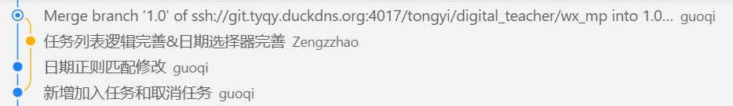

# Vue普通语法中的坑

## watch

**传值**

传“ref 本身”给 watch：`watch(msg, cb)` 会自动追踪 `msg.value`，无需 `.value`、也不需要 `deep`。

**传getter函数**

`watch(() => msg, cb)` 

当前msg为ref 对象时，没有读取 `.value`，因此不会因 `value` 变化而触发；只有在 ref 被整体替换时才触发。加上 `deep: true` 才会往下递归到 `.value`，所以才看起来“能监听到”。


# Vue高级API

## defineProps

[props](https://cn.vuejs.org/api/options-state#props)

**普通js的defineProps（运行时声明）**

```ts
// 使用字符串数组的方式定义
defineProps(['name','age'])

// 使用对象的形式
defineProps({
	name:{
		type:String,
		default:'张三'
	}
})
```

**TS+defineProps（类型声明）**

使用类型声明静态分析会自动生成等效的运行时声明[官网](https://cn.vuejs.org/api/sfc-script-setup#type-only-props-emit-declarations)

```ts
// 利用泛型传递纯类型参数的方式定义
// 泛型直接传入字面量
defineProps<{
    name:string
}>()
// 泛型传入接口
interface Props{
    name:string
}
defineProps<Props>()
```

使用类型声明时指定默认props：withDefaults()

```ts
interface Props{
    name:string
}
const props=withDefaults(defineProps<Props>(),{
    name:'张三'
})
```


## defineEmits

**普通js的defineEmits（运行时声明）**

```vue
const emits=defineEmits(['change','delete'])
```

**TS+defineEmits（类型声明）**

```vue
const emits=defineEmits<{
	(e:'change',value:string):void
    (e:'update'):void
    // 事件名  需要传递的值（可无）
}>()
```

更简洁的语法糖

```vue
const emits=defineEmits<{
    'close':[],
    'success':[id:number,val:string]         
}>()
```


## effectScope

批量管理副作用，在适当的时机统一清理

## defineModel

以前在自定义组件上使用v-model需要在子组件内通过defineProps定义属性、defineEmits定义事件，并在相应的时候触发事件将最新值抛给上层。而有了defineModel后简化了子组件该过程，在子组件内部直接使用defineModel即可声明一个双向绑定 prop，它在底层声明了一个prop和一个相应的值更新事件，无需再使用defineProps、defineEmits。

```ts
// 声明了一个content的prop，父组件通过v-model:content使用
const content=defineModel('content',{type:String,defalt:''})
// 修改该值时，自动触发update:content事件抛给上层
content.value='1111'
```

## defineOptions

用于在script的setup中设置原来只能写在export default{}里的组件选项

inheritAttrs配置：默认为true，vue会自动把组件上接受到的非props的所有attribute自动绑定到组件模板的根节点上


# Vue的样式作用域控制

## scoped

给组件style标签加上scoped后，vue会给当前组件每个元素加上一个唯一的数据属性data-v-xxx实现样式隔离，我们在style中写的常规的不加深度选择器的样式最终转换如下，使得父组件中写的样式无法直接选中子组件内部的元素

> 子组件最外层容器同时拥有父组件的数据属性、子组件自身的数据属性，所以父组件可以选中子组件最外层容器

```css
.test{
  color:red
}
--->转换后
.test[data-v-c815ea7e]{
  color:red;
}
```

## :deep()深度选择器

使用了深度选择器的样式最终转换如下，原理是重组CSS选择器，将唯一数据属性前移到目标选择器前，从而可以选中对应元素

```css
:deep(.test){
  color:red
}
--->转换后
[data-v-c815ea7e] .test{
  color:red;
}
```

常用于修改第三方组件样式

## :global()全局选择器

定义全局样式，不加上当前组件的作用域数据属性，对整个应用中所有匹配到的元素都生效

```css
:global(.test){
  color:red
}
--->转换后
.test{
  color:red
}
```

常用于修改一些被渲染到 `<body>`根节点下的组件（如使用 `Teleport`的弹窗、消息提示等），由于其不在当前组件树内，使用 `:deep()`可能无效，此时需要使用 `:global`


# VueUse

## 最佳实践

返回一个对象，使用者通过对象解构提取所需内容

副作用清理：自动清理副作用，如果需要手动释放副作用则返回一个停止函数stop

## useRequest

[文档](https://mahoushoujoarale.github.io/vue-useRequest-docs/)

```ts
const {
    loading: detailLoading,
    error: detailErrorRef,
    run: runGetModelDetail,
    cancel: cancelGetModelDetail,
} = useRequest(getModelDetailService, {
    onSuccess: resp => {
        const modelDetailData = resp.data;
        // 判断是否展示 Claude 提醒
        showClaudAlert.value = modelDetailData.vendorName === 'Anthropic';
        document.title = `模型详情-万擎-${modelDetailData.name}`;
        modelInfoFromApi.value = modelDetailData;
        if (modelDetailData?.modelFamily) {
            runGetFamilyModels({ modelFamily: modelDetailData.modelFamily });
        } else {
            familyModelsResponseData.value = { total: 0, list: [] };
        }
    },
    onError: e => {
        ElMessage.error(e.message || '加载模型详情时发生网络错误');
        familyModelsResponseData.value = { total: 0, list: [] };
    },
});
```


# Vue指令

## v-for

**遍历数组**

```vue
const arr=[1,2,3]
<div v-for="(value,index) in arr">
  {{value}}--{{index}}
</div>
// vlaue为数组元素值，index为数组元素在数组中的索引
```

**遍历对象**

```vue
const obj={
	name:'zzz',
	age:20
}
<div v-for="(value,key,index) in arr">
  {{value}}--{{key}}--{{index}}
</div>
// vlaue为属性值，key为属性名，index为该属性在对象中的索引
```


# Typescript

## declare

declare通常用在类型声明文件（.d.ts）中

**声明模块**

用于扩展第三方模块

```ts
declare module '模块名'{
  interface A{
    x:x
  }
}
```


# 项目打包器

baidi->rspack


# git

## ssh、https与git config的name与email区别

ssh和https是两种连接和认证到远程仓库的方法

设置git config的user.name与user.email用来标记每次代码提交commit

## 命令

git pull：在A分支上执行git pull会1.更新当前分支为远程最新代码；2.获取所有分支的最新信息（但不会将其他分支更新到最新代码，其他分支要更新必须切换到对应分支后再pull更新）

查看本地分支：git branch

查看所有分支（本地+远程）: git branch -a

查看本地与远程分支跟踪情况：git branch -vv

## 常规流程

拿到一个项目仓库时的基本步骤：

git clone将仓库克隆到本地

如果远程仓库中已经创建好分支，规定了你在dev分支上开发，则git checkout dev切换分支，之后npm i安装依赖进行开发；

如果远程仓库没有创建分支，需要你自己创建一个分支开发，则git checkout -b dev创建dev分支并切换到dev分支开发（git checkout -b dev等效于git branch dev创建dev分支、git checkout dev切换到dev分支），之后npm i安装依赖进行开发（由于远程仓库没有该分支，之后git push -u origin 分支名，首次推送后远程仓库会自动创建新分支）

> 基于dev分支创建feature/a分支：
>
> 方法1：先git checkout dev切换到dev分支，之后git checkout -b feature/a创建并切换到feature/a分支
>
> 方法2：先git branch feature/a dev基于dev创建feature/a分支，再git checkout feature/a切换到feature/a分支
>
> git checkout -b 新分支：基于当前所在分支创建新分支
>
> git checkout -b 新分支 源分支：基于源分支创建新分支

本地开发完时要提交代码到远程仓库，有如下两种方式

1. 先git stash将本地修改放到暂存区，然后git pull拉取远程更新，之后git stash pop将本地修改从暂存区取出（此时可能会要解决远程更新与本地修改的冲突），冲突解决完毕后git add .、git commit -m 'xxx'、git push（首次push时需要git push -u origin dev设置上游分支，跟踪远程分支）
2. 先git add .和git commit -m 'xxx'提交本地修改，之后git pull --rebase拉取远程更新同步并合并本地修改（此时可能会要解决远程更新与本地修改的冲突），冲突解决完毕后git add 冲突文件、git rebase --continue、git push（首次push时需要git push -u origin dev设置上游分支，跟踪远程分支）


**提交信息书写规范**

提交的类型：提交的内容

feat：新功能

fix：修补bug

docs：文档

style：格式（不影响代码运行的变动）

refactor：重构（不是新增功能也不是修改bug的代码变动）

test：增加测试

chore：构建过程或辅助工具的变动


**情形1：本地已经commit了，但是此时远程仓库有更新，我们commit前未及时pull远程的更新**

此时我们直接push会失败

方法一，直接git pull会将远程更改合并到本地分支，之后git会创建一个新的合并提交（需要你自己命名），如下图



方法二，使用git pull --base，实现线性的项目历史，这样就不会产生上面的分支以及合并提交Merge，而是直线历史

rebase会先取出你本地的修改，暂时移除它们，之后将远程分支的新修改作为新基线，之后将本地修改重新应用到新基线

> 若已经先普通pull了形成了分支历史，此时想改用rebase形成线性历史，则git reset --hard ORIG_HEAD回退到合并前状态，之后执行git pull -rebase，最后再git push推送

**引发冲突的情况**

- 同一文件的同一区域被修改

  > 例如，A修改了index.html的第10-20行，B修改了index.html的第15行

- 一个修改了文件，另一个删除了文件

  > A修改了style.css，B删除了style.css

**不会引发冲突的情况**

- 修改不同文件，自动合并
- 修改同一文件不同区域，自动合并
- A修改文件，B未改动，自动应用A的修改
- A删除文件，B未改动，自动删除
- A重命名文件，B未改动，自动重命名


## Merge Request(MR)

MR/PR：将其他开发分支合并入主分支master。

**发起MR前当前分支的最佳实践：**当前分支A基于main分支建立后开发了一段时间后开发完想要往main分支上合时，此时可能其他人在我们新建A分支时建立了其他特性分支开发并已经往main上合并了，A分支上有许多当前main上没有代码，此时我们直接创建MR，github/gitlab平台会自动尝试进行一次模拟合并，会出现以下两种情况：

1. 如果当前分支A与main分支没有冲突，则MR界面会显示一个”可以自动合并“的按钮，审核者点击合并后git会自动将代码合并

2. 如果当前分支A与main分支有冲突，则MR界面会显示无法自动合并，需要解决冲突后才会变成”可以自动合并“的按钮。这时可以是审核员自己在平台web界面上处理冲突后再合并；也可以审核员评论让开发者在本地处理冲突后在提交，审核完毕后再合并。

   > 开发者本地处理冲突：
   >
   > 切换到main分支后更新最新代码，切换回A分支，合并main
   >
   > ```bash
   > git merge main
   > ```
   >
   > 此时需要解决冲突，解决冲突后在commit即可
   >
   > ```bash
   > git add .
   > git commit -m 'Merge main into A and resolve conflicts'
   > ```

**发起MR后该分支后续的commit在合并成功前都能实时显示看到：**创建好从A分支到main分支的MR后，如果审核人评论让你修改，你在A分支上修改push后审核人能看到当前分支的最新修改代码，等到审核通过后就可以合并。


# ks环境

prod：业务线上环境，真正承载用户流量的环境

preonline：预上线环境

staging：测试环境

dev：本地开发环境


# ks的各个平台

天穹：前端代码审查

破晓：无头浏览器

KDev：对标gitlab的代码仓库

天琴：CICD流水线平台

天问：监控平台

Team：记录产品的需求单、测试的bug单的工单系统


# 泳道

通过泳道将各个开发分支的测试环境隔离开，互不干扰

**实现**

访问测试地址时在请求头中加上一个特定字段标识（通过Chrome浏览器插件ModHeader - Modify HTTP headers实现）为xx泳道，反向代理服务器nginx会根据该请求的请求头header中该字段表示打到不同的泳道环境里，从而实现了各自开发分支的测试互不影响

> ModHeader：一个用来修改 Http 请求 Header 内容的浏览器插件。
>
> 利用了浏览器扩展（Extensions) API 中的 [webRequest](https://link.juejin.cn?target=https%3A%2F%2Fdeveloper.mozilla.org%2Fen-US%2Fdocs%2FMozilla%2FAdd-ons%2FWebExtensions%2FAPI%2FwebRequest) 相关的 API 实现的。主要利用的是`onBeforeSendHeaders`和`onHeadersReceived`事件来分别修改请求头和响应头。利用 webRequest 相关的 API，还可以做一些取消、重定向请求的操作。


# 术语

回归测试：确保已有功能在进行修改或新增功能后依然正常工作的测试。当代码发生变更或修复 bug 后，回归测试可以确保这些变更没有引入新的错误或重新引入旧的错误。


# ProseMirror

基于Schema（结构文档模型）+ Transaction（事务）+ State（状态）+ Plugins（插件）的富文本编辑框架。

ProseMirror不是操作HTML的dom元素，而是操作一个类似Json、AST的树形文档结构。为了在浏览器中呈现编辑器内容需要将文档结构转换为dom元素，为了保存编辑内容需要将dom元素转换为文档结构

## 基本模块

Prosemirror-model：定义编辑器的文档模型，描述编辑器内容的数据结构

Prosemirror-state：描述编辑器整个状态的数据结构，包括光标选区、从一个状态转移到另一个状态的事务系统

Prosemirror-view：将编辑器状态转换为浏览器dom元素，并处理用户与该元素的交互

Prosemirror-transform：用可记录和可重放的方式修改文档的功能，支持撤销历史记录和协作编辑

## 核心概念

Schema：定义文档可以有哪些内容，由Node和Mark组成，Node是文档中的某个内容元素，如 `doc`、`paragraph`、`text`；Mark是附着在text文本节点上的样式，如 `bold`、`italic`、`underline`。

> 文档树中节点分为两类：Node（类型结构节点，以纯文本节点作为子节点，比如'paragraph'、'heading'），TextNode（纯文本节点，没有子节点，即叶子节点，比如'hello'、'你好'等）

State：文档存储在state中，所有对编辑器的操作都通过transaction应用到state上。state包含了当前文档doc、当前光标选区selection、当前激活的标记storedMarks、插件状态pluginStates

```
state.doc:当前文档
state.selection:当前光标选区
state.storedMarks:存储的 Mark（空选区下的“将应用的样式”）
state.schema:Schema
state.plugins:当前启用的 PM 插件数组
state.tr:创建一个新的 Transaction
```

> doc上的属性与方法：
>
> ```
> doc.type：节点类型（Schema 中的 NodeType，例如 doc、paragraph）
> doc.attrs：节点属性对象（如 {level: 1}）
> doc.content：Fragment，子节点集合容器
> doc.marks：节点上的 mark 列表（文本节点常有）
> 
> doc.child(index)：获取第 index 个子节点
> doc.textBetween(from, to, blockSeparator?, leafText?)：读取文档片段文本
> doc.descendants((node,pos,parent,index)=>booleam|void)：对文档树的深度优先遍历DFS
> 回调中的参数：node为当前遍历到的节点,pos为当前节点在文档中的绝对位置,parent为当前节点的父节点,index为当前节点是父节点的第几个子节点
> 回调返回false则跳过该节点的子节点，不在继续深入
> ```
>
> selection上的属性与方法
>
> ```
> selection.from：选择起点位置（number）
> selection.to：选择终点位置（number）
> selection.anchor：锚点位置（number）
> selection.head：头部位置（number）
> selection.empty：是否为空选区（光标态）
> selection.$from / selection.$to：ResolvedPos解析位置（包含更丰富的位置信息）,内部包含pos在整篇文档里的绝对数字位置,parent为所在父节点
> selection.ranges：范围列表（一般单一范围，少用）
> 
> selection.eq(other)：是否与另一选择相等
> selection.content()：返回被选中的 Slice
> ```
>
> 

Transaction：所有对编辑器的操作都必须通过Transaction完成，提交Transaction生成一个新的state更新视图

Plugin：提供了props（提供钩子，拦截dom事件）、state（插件自己的state）、view（视图生命周期）

Decoration：不属于schema，仅用于UI显示

> 装饰器允许你控制视图绘制文档的方式
>
> 分为三类：
>
> Node decorations节点装饰器：为单个节点的 DOM 表示添加样式或其他 DOM 属性。
>
> Widget decorations小部件装饰：会在指定位置*插入*一个 DOM 节点，该节点不属于实际文档的一部分。
>
> Inline decorations内联装饰器：可以像节点装饰器一样添加样式或属性，但它是添加到给定范围内的所有内联节点。
>
> ```js
> Decoration.widget(pos, domOrFactory, options?)
> ```
>
> 

InputRules：输入规则

EditorView：渲染文档结构为真实dom


# Tiptap

基于ProseMirror的无头（不提供样式）富文本编辑器框架。tiptap的所有功能都通过extension组成，tiptap将每个extension解析成prosemirror构件，简化了prosemirror

## Command

底层创建一个transaction，改变编辑器状态（内容、选区等）

每个command命令只会作用于当前selection选区，仅返回true/false

### 使用command的两种方式

**直接调用**

```ts
editor.commands.xxx()
// 每次只能执行一个command，使用后立即执行
```

**链式调用**

```ts
editor.chain().xxx1().xxx2().xxx3().run()
```

`.chain()`创建一个command队列，将xxx1()、xxx2()、xxx3()依次加入到队列中，`.run()`时才会依次执行队列中所有command


## 三大件

### Node


### Mark


### Extension

tiptap所有功能通过extension实现

### 常用钩子

#### 属性

name：声明扩展名称

priority：优先级，决定扩展的注册顺序，优先级高的扩展优先运行

inclusive：标记是否节点的起始点、结束点，为true时表示包含左右边界点，此时光标在右边界继续输入会继承此标记

#### addOptions()

设置扩展的配置，用户可以在注册扩展时通过configure()在置扩展的配置项

#### addAttributes()

在Node/Mark中声明可以存在于schema中的属性/数据以及其默认值、html解析规则、html渲染规则

相当于给Node/Mark增加字段，被存进prosemirror的schema中，能写入dom元素中并从dom元素中解析出来，可以通过commands修改

```ts
// 基本结构如下
addAttributes(){
  return{
    '属性名':{
      default:默认值,
      parseHTML:element=>返回属性值
      renderHTML:attributes=>返回HTML属性
    }
  }
}
```


#### parseHTML()

HTML → Doc  解析外部内容（setContent、paste）

#### renderHTML()

Doc → HTML  导出 HTML 时使用

#### addCommands()

注册命令  可通过 `editor.commands.xxx()` 调用

#### addInputRules()

**功能：**定义输入触发规则，在用户通过编辑器真实输入且没有被阻止的情况下才会触发输入规则进行匹配（如果在特定按键输入的拦截中return true阻止了默认字符输入则不会触发输入规则；通过命令`insertContent()`编程式插入也不会触发输入规则），用于自动转换输入（如 `**bold**`）

**多个扩展的输入规则的执行先后顺序：**priority高的优先执行，priority相同时按照扩展注册的顺序执行，先匹配到的规则将后续规则短路

**与键盘监听的执行先后顺序：**晚于addKeyboardShortcuts键盘监听执行

#### addPasteRules()

定义粘贴触发规则，用于粘贴内容自动格式化

#### addKeyboardShortcuts()

**功能：**定义快捷键（如 `Cmd+B` 加粗）、拦截特定的按键输入进行特殊处理

**返回值：**返回true表示当前键盘输入已经被扩展处理，阻止默认的字符输入，并阻断后续扩展的同键处理；返回false表示不会阻止默认字符输入，同时交给下一个扩展继续处理

**多个扩展对相同按键拦截的执行先后顺序：**priority高的优先执行，priority相同时按照扩展注册的逆序执行，后注册的扩展先执行

**与输入规则的执行先后顺序：**先于addInputRules输入规则执行

#### addProseMirrorPlugins()

注入原生 PM 插件  高级行为定制

#### 事件

### 核心方法

getMarkRange(ResolvedPos,markType)：传入一个ResolvedPos和某个mark类型，返回该mark的整体范围{from:number,to:number}，用于快速获取整个mark边界进行整体删除、替换等操作


## 保存与回写

TipTap编辑器的内容可以存储为Json格式/Html字符串，且两者都可以传入编辑器进行内容回写。使用`getJSON()`即可获得编辑器中富文本内容的Json格式，使用`getHTML()`即可获得编辑器中富文本内容的Html字符串


# 其他

## 通用可复用方案：自定义 v-click-outside 指令（支持排除区）

如果项目里有多处“点击外部关闭”的需求，建议封装为指令，排除区（例如触发按钮）通过 include 传入。

指令核心实现：

```ts
// v-click-outside.ts
import type { DirectiveBinding } from 'vue';

type Options = {
  handler: (e: PointerEvent) => void;
  include?: (() => Array<HTMLElement | null | undefined>) | Array<HTMLElement | null | undefined>;
};

type ElWithCb = HTMLElement & { __onClickOutside__?: (e: PointerEvent) => void };

export default {
  mounted(el: ElWithCb, binding: DirectiveBinding<Options>) {
    const getIncludes = () =>
      typeof binding.value?.include === 'function'
        ? binding.value.include()
        : binding.value?.include ?? [];

    const onPointerDown = (e: PointerEvent) => {
      const path = (e.composedPath?.() || []) as EventTarget[];
      const includes = getIncludes().filter(Boolean) as HTMLElement[];

      const isInEl = path.includes(el);
      const isInIncludes = path.some(t =>
        includes.some(inc => inc && (t === inc || (t instanceof Node && inc.contains(t as Node))))
      );

      if (!isInEl && !isInIncludes) {
        binding.value?.handler?.(e);
      }
    };

    el.__onClickOutside__ = onPointerDown;
    document.addEventListener('pointerdown', onPointerDown, { capture: true });
  },
  unmounted(el: ElWithCb) {
    if (el.__onClickOutside__) {
      document.removeEventListener('pointerdown', el.__onClickOutside__, { capture: true });
      delete el.__onClickOutside__;
    }
  },
};
```

使用方式（在面板根节点上用指令，排除触发按钮）：

```ts
<script setup lang="ts">
import vClickOutside from './v-click-outside';
const panelRef = ref<HTMLElement | null>(null);
const triggerRef = ref<HTMLElement | null>(null);
</script>

<template>
  <PromptParameterEditor
    ref="panelRef"
    v-show="showPromptParameterEditor"
    v-click-outside="{
      handler: () => (showPromptParameterEditor = false),
      include: () => [triggerRef, ...Array.from(document.querySelectorAll('.add-var-btn'))]
    }"
    ...
  />
  <button ref="triggerRef" class="add-var-btn" @click="showPromptParameterEditor = true">打开</button>
</template>

<script lang="ts">
export default {
  directives: { clickOutside: vClickOutside },
};
</script>w
```

