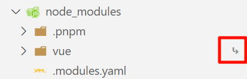
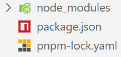
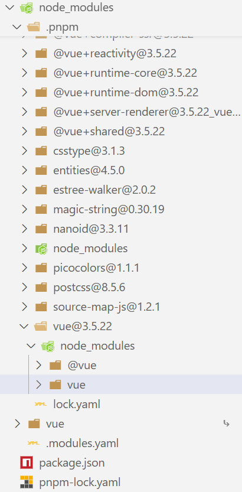
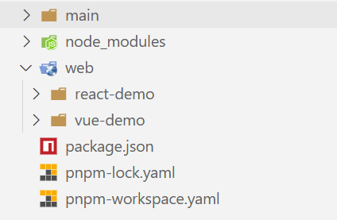

# pnpm

**软链接/符号链接：**后面的文件只是创建一个指向前面文件的快捷方式

**硬链接：**前后两份文件指向同一个磁盘地址，两者内容一样

**于npm的区别：**

依赖存储方式：npm每个项目都有一份node_modules依赖重复存储，占用大量磁盘空间；pnpm所有依赖统一存储在全局~/.pnpm-store，项目中的node_modules使用硬链接指向它，节省空间

安装速度：首次需要远程下载，后续依赖复用

**优势：**节省磁盘空间并提升安装速度

## 开发实际使用

vscode中的软链接文件，其右侧有一个箭头，这个表示该文件是软链接

使用命令pnpm init后，会生成pageage.json

之后再使用pnpm i vue安装相应的文件时，会生成一个pnpm-lock.yaml锁定版本号的文件以及node_modules

在node_modules中会显示安装的vue，我们可以看到安装的vue是一个软链接，指向的是在.pnpm中的vue，.pnpm中的vue通过硬链接的方式指向了.pnpm-store仓库中的包

# monorepo

建立一个pnpm-workspace.yaml配置工作空间，之后再使用pnpm i安装依赖

优点是三个项目main、react-demo、vue-demo中共同的依赖会提到顶层的node_modules中，各自项目中的node_modules中只存放各自单独需要的