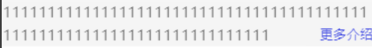
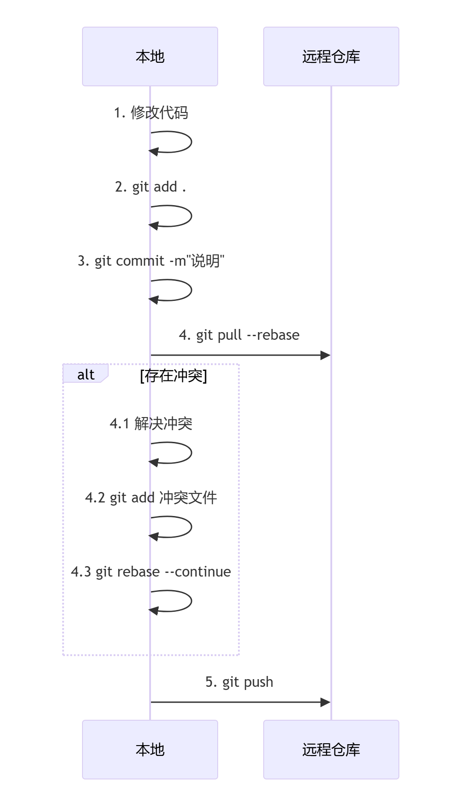

# BFC块级格式上下文

> 创建条件：
>
> 浮动，绝对或固定定位元素
>
> overflow不为visible的块盒（position设置为非static就会当作定位元素处理，不会触发BFC）

主要影响块级盒子的布局、浮动等，不直接影响层叠上下文


# 伪元素选择器

伪元素`::before，::after`的直接父元素就是它附加的元素本身


# 定位元素的四个值

设置为百分比时，top、bottom是相对于包含块的高度height而言；left、right是相对于包含块的宽度width而言


# 弹性布局flex属性

每个弹性项目都有一个flex属性，这个属性是flex-grow、flex-shrink、flex-basis三个属性的简写形式，定义了弹性项目如何伸缩以适应容器空间

默认值: flex: 0 1 auto不放大、可缩小、尺寸由内容决定

flex-grow：容器有剩余空间时，项目如何放大分配剩余空间，按照各自的flex-grow数值比例进行分配

flex-shrink：容器空间不足时，项目如何收缩，按照各自flex-shrink数值比例进行收缩

flex-basis：定义项目初始主轴尺寸，默认auto根据内容自动计算

**单值语法**

```css
数值
flex:1 => flex:1 1 0% 可放大可收缩，初始大小为0
尺寸值
flex:200px => flex:1 1 200px 可放大可缩小，初始大小为200px
关键字
flex:auto => flex:1 1 auto 可放大可收缩，初始大小由内容决定
flex:none => flex:0 0 auto 不可放大、不可收缩，固定尺寸
```


# JS中的类

```js
class A extends B{
    // 类字段，用来定义不依赖于构造函数参数的属性
    prop1=1
    prop2
    // 私有属性，类的外部无法访问
    #prop4
    // 构造函数
    constructor(prop2,prop3){
        // 调用继承的父类B的构造函数，传入参数1，2，3至父类构造函数中
        // super()必须在使用this与构造函数返回前调用
        super(1,2,3)
        // super()后才可以通过this访问正在创建的主体
        this.prop2=prop2
        this.prop3=prop3
    }
    // 方法，定义在类原型上，所有实例对象共享使用，通过实例对象调用
    test(){
        // 方法中通过this访问其他字段属性和其他方法
        console.log(111)
    }
    // 静态方法，定义在类自身（构造函数），通过类调用
    static test2(){
        console.log(222)
    }
}
```


# TS+类

可见性修饰符：public、protected、private

```ts
class A{
    // 默认public，可以在任何地方访问
    public prop1:number
    // 只允许对其声明类的子类可见
    protected prop2:number
    // 私有属性，类的外部无法访问
    private prop3:number
    // 静态成员，也可以使用可见性修饰符
    private static prop4 = 0
}
```


# JS中的Date类

new Date()有多种创建日期对象的形式

```js
// 空构造函数：当前日期时间
const now=new Date()
// 时间戳，相当于 2023-01-01T00:00:00.000Z
const date=new Date(1672531200000)
// 日期字符串
const date=new Date('2023-10-15')
const date=new Date('2023-10-15T14:30:00+08:00')
// 多参分别传入
const date=new Date('年','月','日')
// 复制其他Date对象
const origin=new Date()
const copy=new Date(origin)
```


# h5与微信小程序获取元素实例高度的区别

h5通过el.scrollHeight获取元素实例的高度

微信小程序通过uni.createSelectorQuery().select().boundingClientRect获取元素实例的高度

在元素设置了overflow:hidden的情况下，h5不受影响获取的是元素内容区域的总高度（可视区+溢出隐藏区），微信小程序受影响获取到的只是元素可是区的高度


# 更多介绍--自定义组件

之前代码采用比较元素实例的高度与组件定义好的高度限制进行比较，若元素实例的高度大于高度限制则显示展示更多的按钮。

但是当内容刚到高度限制那行没有超过高度限制时，也会显示更多介绍，但是实际上此时不需要显示更多介绍，见下图



**使用方案**

字符数估计法：计算每行可以显示的文字个数（元素的width/font-size），若文本内容超过了每行可以显示的文字个数*最多行数则需要显示展示更多的按钮

双节点法：

## css控制换行行为的属性

white-space：控制空白符（空格、制表符、换行符）的处理方式

- normal：默认，合并空格自动换行
- nowrap：合并空格，禁止换行

word-warp/overflow-wrap：控制长单词是否换行

- normal：默认，只允许单词间换行
- break-word：允许在单词内换行

word-break：

- normal：默认，只允许单词间换行
- break-all：允许在任意字符间换行


## 文本超过单行出现省略号

```css
{
    white-space:nowrap;
    overflow:hidden;
    text-overflow:ellipsis;
}
```


## 文本超过多行出现省略号

```css
{
    display:-webkit-box;
    -webkit-line-clamp:2;
    -webkit-box-orient:vertical;
    overflow:hidden;
    word-break:break-all;
}
```

    webkit浏览器的私有属性；
    -webkit-box为旧版弹性盒模型；
    -webkit-line-clamp限制文本最大行数，当文本超过指定行数时，自动在最后一行末尾添加省略号...
    -webkit-box-orient设置文本垂直方向排列，使-webkit-line-clamp生效的必要条件
    overflow: hidden超出容器隐藏内容
    word-break:break-all即使一长串数字也会从字符中间换行


# vue3生命周期

vue3中有beforeCreate、created、setup()、onBeforeMount、onMounted、onBeforeUpdate、onUpdated、onBeforeUnmount、onUnmounted，在setup语法糖中在setup中直接直接写逻辑替代beforeCreate、created两个生命周期，其他生命周期api在setup中用回调函数的形式写


# uniapp生命周期

应用级生命周期

- onLaunch：应用初始化时触发，全局只触发一次
- onShow：应用启动/切入前台时触发
- onHide：应用隐藏/切入后台时触发

页面生命周期

- onLoad：页面加载时触发，只触发一次，回调里的参数为上个页面传递的数据

- onShow：页面显示/切入前台时触发，包括首次进入和从其他页面返回

- onReady：页面初次渲染完成时触发，只触发一次

- onHide：页面隐藏/切入后台时触发，包括从当前页面跳转到其他页面

- onUnload：页面卸载时触发（关闭了当前页面），包括redirectTo或reLaunch或navigateBack导航时（这两个会关闭当前页面/所有页面，跳转到目的页面/返回上一页）

```
页面A跳转到页面B时生命周期的执行顺序:
A的onHide（页面隐藏）
B的onLoad（首次加载）
B的onShow（页面显示）
B的onReady（页面渲染完成）

页面B返回页面A时生命周期的执行顺序:
B的onHide（页面隐藏）
B的OnUnload（如果是redirectTo或reLaunch或navigateBack）
A的onShow（页面显示）
```


组件生命周期：同vue3的生命周期

在页面和组件.vue文件中都可以使用页面生命周期、组件生命周期

执行顺序如下

```
页面加载时：
页面onLoad、页面setup、页面onShow、页面onBeforeMount、子组件setup、子组件onBeforeMount、子组件onMounted、页面onMOunted、页面onReady

页面卸载时：
页面onHide、页面onUnload、页面onBeforeUnmount、子组件beforeUnmount、子组件onUnmounted、页面onUnmounted
```


# 微信小程序与H5网页在页面管理上的区别

Vue H5：单页应用SPA架构，通过路由切换组件

当路由切换时，不保留页面状态，销毁旧页面（所有变量全部释放），创建新页面


微信小程序：多页应用架构，使用页面栈管理多个页面

当路由切换时，若是使用不关闭当前页面的跳转方式则保留页面状态，不会销毁旧页面（所有变量的数据保留），当返回时数据任然是跳转前的状态

若是使用了关闭当前页面的跳转方式，则与Vue H5一样了，不保留页面状态，销毁旧页面（所有变量全部释放），创建新页面


# vue3中的composables文件夹

专门用于存放基于组合式API封装的可复用的逻辑函数，类似于React中的自定义钩子

**例子**

```js
useCounter.ts
export function useCounter(initValue=0){
    const count=ref(initValue)
    const increment=()=>count.value++
    const decrement=()=>count.value--
    return {count,increment,decrement}
}

使用
import {useCounter} from ''@/composables/useCounter'
const {count,increment,decrement}=useCounter()
之后就可以直接使用count,increment,decrement
```


# vue内置Transition组件

可以将进入/离开动画应用到通过默认插槽传递给他的组件上。

进入/离开条件如下：

1. v-if触发
2. v-show触发
3. <component>触发的动态组件
4. 改变key属性值触发

在css中书写6个类：v-enter-from，v-enter-active，v-enter-to，v-leave-from，v-leave-active、v-leave-to控制过渡特效，可以通过传递name属性来声明过渡特效名

Transition组件提供了自定义事件，用于过渡过程中挂上钩子


# vite获取命令行传递参数

命令行传参

```bash
npm run dev -- --a=1 --b=2
npm run dev -- --a 1 --b 2
```

传递的参数在vite中获取

```ts
通过process.argv获取到Node.js进程启动时传入命令行参数
第一个元素是Node.js执行路径
第二个元素是正在执行的js文件路径
后续元素为传递给脚本的命令行参数（以空格分隔）
--a=1为'--a=1'
--a 1为'--a'和'1'
```


# vite的Glob导入

import.meta.glob函数从文件系统中导入多个模块

详细使用用法见[官网](https://cn.vite.dev/guide/features.html#glob-import)


# vite的环境变量

import.meta.env获取当前环境下的环境变量，可以建立`.env`等文件建立不同环境下的环境变量

详细使用用法见[官网](https://cn.vite.dev/guide/env-and-mode.html)


# 小程序运行原理

逻辑层与视图层分离，逻辑层负责执行业务逻辑（运行js代码），视图层负责页面渲染；虽然开发者在一个vue文件中写了js和css，但其实编译时就已经将它们拆开了

视图层与逻辑层分离，好处是js运算不卡渲染，窗口动画稳；坏处是两层相互通信有损耗


# 微信小程序登录

[官网登录说明](https://developers.weixin.qq.com/miniprogram/dev/framework/open-ability/login.html)

前端使用wx.login()获取临时登录凭证code发送给服务端，服务端使用该code去微信接口获取到session_key、openid，之后自定义登录态与session_key、openid绑定并将自定义登录态token返回给前端，前端之后携带该自定义登陆态token进行正常业务即可


# 分包配置

[官方文档](https://uniapp.dcloud.net.cn/collocation/pages.html#subpackages)

因小程序有体积和资源加载限制，通过分包解决该问题，优化小程序的下载和启动速度。

> 应该遵循的原则：
>
> 主包只引用主包内容，不要在主包中直接引用分包模块
>
> 分包自治，每个分包相对独立，只使用自己分包内容或主包中共享的内容


# SSE

SSE（Server-Sent-Events）是服务器向客户端持续推送数据的协议，客户端请求一次服务器后，服务器可以不断发送多次数据，属于单功通信（客户端发一次无法通过同一连接发送数据，服务端可以发多次）

而websocket属于双功通信，客户端请求一次服务器后，服务器可以不断发多次数据，客户端也可以再发多次数据

**后端服务器SSE返回的消息格式**

SSE响应的每条完整消息以两个连续换行符（\n\n）结尾

```
event:事件类型（可选）用于标识事件类型，客户端根据该事件类型名进行监听，若未指定浏览器触发默认message事件
data:消息内容行1（必需）如果数据内容很长可以分为多行，每行以data:开头，客户端会自动将它们拼接为一个字符串
data:消息内容行2（必需）
id:消息id（可选）
retry:重连时间（可选）
\n
\n
```

多个data行时客户端会自动拼接为一个“消息内容行1\n消息内容行2”

axios在浏览器换件下基于XMLHttpRequest（XHR）实现，不能用于流式场景（不支持流式读取响应）

要实现流式场景，有两种方案：

原生的EventSource：简单稳定、自动重连，事件协议开箱即用；但是仅支持get请求，无法带自定义header，只能通过cookie/query传参

fetch：支持post、可自定义header；但是需要自己解析sse文本协议与重连中止

**使用fetch实现SSE**

不可以通过.then的方式，因为.then必须等到整个响应完成后才能获取数据，对于长连接/持续推送场景完全不适应，应该创建流式读取器，在数据到达时立即处理，实现实时响应

一个sse数据在传输中可能会被tcp分成多个数据包，导致每次流式读取器读取到的数据块chunk可能有如下情况：一个完整的sse消息、多个事件拼在一起（粘包）、后半部分还没到（半包），所以需要通过一个额外变量buffer用来处理流式数据的分包问题，确保每个sse事件都是完整的再进行处理

```ts
try {
    const buffer = ''
    const response = await fetch(url, {
        method: 'POST',
        headers: {
            'Content-Type': "application/json"
        },
        body: JSON.stringify(data)
    })
    // http错误/此浏览器不支持流式读取
    if (!response.ok || !response.body) {
        throw new Error('服务器响应错误/响应体不可读')
    }
    // 上一个await等待了响应头全部接收完全,当前开始接收响应体了
    // 流式读取数据
    const reader = response.body.getReader() // 流式读取器
    const decoder = new TextDecoder() // 二进制数据解析为字符串的解析器
    while (reader) {
        const { value, done } = await reader.read()
        if (done) break
        const text = decoder.decode(value)
        // 将新数据添加到缓冲区
        this.buffer += text
        // 按照SSE格式分割事件，这里是使用双换行符作为事件边界
        const events = this.buffer.split('\r\n\r\n')
        // 将事件队列中最后一个可能是不完整的事件从事件队列中移除放到缓冲区中
        this.buffer = events.pop() || ''
        // 处理所有完整事件
        for (const event of events) {
            if (event.trim() === '') continue
            let data = ''
            // 解析SSE事件格式
            event.split('\r\n').forEach(line => {
                if (line.startsWith('data:')) {
                    // 提取data字段内容
                    data += line.substring(5).trim() // 去掉 'data:' 前缀
                }
            })
           // data即为服务器响应的数据了，对其进行操作即可
        }
    }
} catch (e) {
    console.log('SSE Error', e);
}
```

> 传统fetch写法：
>
> ```js
> fetch(url,{})
>     .then(res=>res.text()) // 等待响应头全部到达
>     .then(data=>console.log(data)) // 等待响应体全部到达
> 
> const res=await fetch(url,{}) // 等待响应头全部到达
> const data=await(res=>res.text()) // 等待响应体全部到达
> console.log(data)
> ```


# git

拿到一个项目仓库时的基本步骤：

git clone将仓库克隆到本地

如果远程仓库中已经创建好分支，规定了你在dev分支上开发，则git checkout dev切换分支，之后npm i安装依赖进行开发；

如果远程仓库没有创建分支，需要你自己创建一个分支开发，则git checkout -b dev创建dev分支并切换到dev分支开发（git checkout -b dev等效于git branch dev创建dev分支、git checkout dev切换到dev分支），之后npm i安装依赖进行开发（由于远程仓库没有该分支，之后git push -u origin 分支名，首次推送后远程仓库会自动创建新分支）

> 基于dev分支创建feature/a分支：
>
> 方法1：先git checkout dev切换到dev分支，之后git checkout -b feature/a创建并切换到feature/a分支
>
> 方法2：先git branch feature/a dev基于dev创建feature/a分支，再git checkout feature/a切换到feature/a分支
>
> git checkout -b 新分支：基于当前所在分支创建新分支
>
> git checkout -b 新分支 源分支：基于源分支创建新分支

本地开发完时要提交代码到远程仓库，有如下两种方式

1. 先git stash将本地修改放到暂存区，然后git pull拉取远程更新，之后git stash pop将本地修改从暂存区取出（此时可能会要解决远程更新与本地修改的冲突），冲突解决完毕后git add .、git commit -m 'xxx'、git push（首次push时需要git push -u origin dev设置上游分支，跟踪远程分支）
2. 先git add .和git commit -m 'xxx'提交本地修改，之后git pull --rebase拉取远程更新同步并合并本地修改（此时可能会要解决远程更新与本地修改的冲突），冲突解决完毕后git add 冲突文件、git rebase --continue、git push（首次push时需要git push -u origin dev设置上游分支，跟踪远程分支）



> 查看本地分支：git branch
>
> 查看所有分支（本地+远程）: git branch -a
>
> 查看本地与远程分支跟踪情况：git branch -vv


**提交信息书写规范**

提交的类型：提交的内容

feat：新功能

fix：修补bug

docs：文档

style：格式（不影响代码运行的变动）

refactor：重构（不是新增功能也不是修改bug的代码变动）

test：增加测试

chore：构建过程或辅助工具的变动


**情形1：本地已经commit了，但是此时远程仓库有更新，我们commit前未及时pull远程的更新**

此时我们直接push会失败

方法一，直接git pull会将远程更改合并到本地分支，之后git会创建一个新的合并提交（需要你自己命名），如下图


方法二，使用git pull --base，实现线性的项目历史，这样就不会产生上面的分支以及合并提交Merge，而是直线历史

rebase会先取出你本地的修改，暂时移除它们，之后将远程分支的新修改作为新基线，之后将本地修改重新应用到新基线

> 若已经先普通pull了形成了分支历史，此时想改用rebase形成线性历史，则git reset --hard ORIG_HEAD回退到合并前状态，之后执行git pull -rebase，最后再git push推送

**引发冲突的情况**

- 同一文件的同一区域被修改

  > 例如，A修改了index.html的第10-20行，B修改了index.html的第15行

- 一个修改了文件，另一个删除了文件

  > A修改了style.css，B删除了style.css

**不会引发冲突的情况**

- 修改不同文件，自动合并
- 修改同一文件不同区域，自动合并
- A修改文件，B未改动，自动应用A的修改
- A删除文件，B未改动，自动删除
- A重命名文件，B未改动，自动重命名


# 交通平台项目

## vue路由懒加载

当打包构建应用时，JavaScript 包会变得非常大，影响页面加载。我们把不同路由对应的组件分割成不同的代码块，然后当路由被访问的时候才加载对应组件，这样就会更加高效。这就是路由懒加载

[文档](https://router.vuejs.org/zh/guide/advanced/lazy-loading.html)

## 高德地图JS API 2.0

### 地图的组成

[文档](https://lbs.amap.com/api/javascript-api-v2/guide/abc/components)

地图容器：准备阶段自己所创建的放置地图的div容器，作为承载所有图层、矢量图形、点标记Marker、控件的容器

图层：标准图层、卫星图层、路网图层、路况图层等，一幅地图通常由一个或者多个图层组成

矢量图形：覆盖于底图图层之上，通过矢量的方式(路径或者实际大小)来描述其形状，用几何的方式来展示真实的地图要素，会随着地图缩放而发生视觉大小的变化，但其代表的实际路径或范围不变

点标记：覆盖于图层之上，标示某个位置点信息的一种地图要素。在屏幕上的位置会随着地图的缩放和中心变化而发生改变，但是会与图层内的要素保持相对静止。

地图控件：浮在所有图层和地图要素之上，用于满足一定的交互或提示功能。相对于地图容器静止，不随着地图缩放和中心变化而发生位置的变化。如比例尺等

## 全屏相关

进入全屏：document.documentElement.requestFullscreen()，让整个网页进入全屏，隐藏浏览器的地址栏、工具栏、书签栏等界面元素

退出全屏：document.exitFullscreen()

检查是否处于全屏：document.fullscreenElement，

- 如果当前**没有元素**处于全屏状态，该属性的值为 `null`。
- 如果当前**有元素**处于全屏状态，该属性的值就是**指向那个全屏元素**的引用。

## background属性

background是多个控制背景样式属性的综合简写

```css
.xxx{
    background:background-color background-image background-position / background-size background-repeat background-attachment background-origin background-clip
}

background-position:定义背景图像的起始位置
background-size:控制背景图像的尺寸
background-attachment:定义背景相对于视口如何滚动, fixed背景固定于视口,local随元素内容滚动
```

## 宽度高度设置为百分比

百分比宽度几乎总能解析为相对包含块的宽度

百分比高度只有在包含块高度确定时才会解析为相对包含块的宽度，否则按 auto 处理（内容自适应）


## 本地预览生产环境下的项目

不能直接在dist文件夹中双击index.html通过浏览器打开

也不能直接通过vscode的插件live serve启动index.html，因为vite的base配置默认为“/”，打包构建路径时生成绝对路径/assets/xxx，而live serve默认把共工作区的根目录当成网站的根目录，不是dist目录，所以启动index.html时会请求模块`/assets/index-DIldpaPy.js`，浏览器会去请求`http://127.0.0.1:5500/assets/xxx.js`，但真实文件在`http://127.0.0.1:5500/dist/assets/xxx.js`

设置为base:"./''，打包构建路径时生成相对路径assets/xxx，浏览器会相对于当前页面的路径去解析，例如打开的是/dist/index.html，那么对于assets/index-xxxxx.js会请求 /dist/assets/index-xxxxx.js

**使用vite预览服务器**

首先npm run build，然后npm run preview启动预览服务器，将以dist为根目录并提供SPA回退，开箱即用

**使用支持SPA回退的静态服务器**

使用第三方的serve库，首先cd dist，然后npx serve -s启动服务器


## SPA

SPA的路由在浏览器里由前端接管，服务器并没有真实的/home，/login文件

SPA回退就是当服务器接收到任何前端路由路径且找不到静态文件时，统一返回dist/index.html，让前端路由接管，再渲染处对应页面


## 路由history模式与hash模式的区别

哈希模式#后的内容不会带给服务器（服务器永远只收到/，返回同一个index.html），只在浏览器中使用，所以不需要服务器配置SPA回退，不会有404的问题

history模式刷新时会将前端路由携带给后端，而后端没有对应的资源匹配就会导致404，所以必须要服务器配置SPA回退


## 样式工程化

vue的scoped使得样式只作用于当前组件模板的元素（在编译时自动添加唯一的属性选择器[data-v-xxxx]），不会对子组件的样式造成影响

> 但是如果子组件的根元素有class则这个class会同时获得父组件的作用域属性[data-v-xxxx]、子组件的作用域属性[data-v-xxxx]，所以可以在父组件的scoped样式中写子组件根元素相同的类class从而影响子组件的根元素的样式，但不能影响其内部的嵌套元素

我们可以在父元素中通过深度选择器穿透作用域，实现在父元素中影响子组件内部元素。这也是我们对第三方元素进行自定义的手段（通过f12开发者工具找到我们要修改元素的类名，然后使用深度选择器穿透样式实现自定义）

**css module**

对于xxx.module.css/scss文件，webpack/vite等打包工具会编译所有类名将其转换为全局唯一的哈希（从而使得类名不会重复），同时记录类名与哈希值的映射，之后可以按照如下方式使用

```js
import style from './xxx.module.css'
:class="style.xxx"
```

**导入样式**

在script中import './xxx.css'是全局导入样式，作用于全局作用域，import './xxx.module.css'则是模块化导入样式，作用于局部作用域

在style中没有scoped无论什么情况都是作用于全局作用域，有scoped则是作用于局部作用域


## 全局导入的scss中写的变量函数子组件需显式导入才可用

写的全局global.scss我们在main.ts中通过import引入，只会将编译后的css注入到页面，不会让scss的变量/函数在全局可以自动使用。scss变量/函数属于编译期的东西，每个其他需要使用这些变量/函数的组件必须先显式引入之后才能使用

> 最佳实践：
>
> global.scss中只写全局样式，不要写其他的scss变量/函数
>
> 单独抽离出一个文件专门写scss变量/函数。然后通过vite配置将整个纯变量/函数模块全局注入，之后即可在每个vue组件的style部分直接使用了


## css变量

css变量以--开头（如--primary-color），通过var(--primary-color,可选默认值)使用


## vite配置

在vite配置中不可以使用import.meta.env加载.env等环境变量配置文件（只能通过loadEnv(mode, process.cwd())加载），但是业务代码中可以通过import.meta.env加载.env等环境变量配置文件

因为import.meta.env是vite构建过程中注入的全局变量，npm run dev在node环境中加载vite配置用此配置开启开发服务器，将环境变量注入，但是我们写的vite.config.js在注入之前，所有访问不到这些变量


## vite代理解决跨域深入理解

先说结论：配置了代理服务器后，所有api路径必须写为相对路径才能使得代理配置生效

开发服务器启动后，使用浏览器打开对应url，浏览器就会去请求开发服务器拿到网页初始js等资源将页面渲染出来。之后通过相对路径写的api会直接请求开发服务器，而配置了代理下开发服务器会去请求实际服务器并将内容返回给前端，也就不会造成跨域了。而如果通过绝对路径写的api不会去请求开发服务器，直接就是浏览器去请求实际服务器了，就造成了跨域。


## 打包构建工程化

**assets文件夹下的资源**

存放需要打包处理的资源（会按需转换、压缩、之文化哈希命名）

在开发环境下，这些文件会被vite的开发服务器处理，通过ES Module方式导入import，Vite会返回处理后的URL即通过/@fs/虚拟路径提供文件服务，如/@fs/E:/company/traffic-platform/src/assets/icon/user.svg?import

在生产环境下，这些文件的文件名会被哈希化重命名（原文件名+哈希值）存放在dist/assets/目录下（vite会自动优化，对于小于4KB的图片会被转为base64内联，对于大于4KB的图片则保留原图片），通过ES Module方式导入import，Vite会将源码中的文件路径变为文件在打包结果中的路径，如/assets/user-a1b2c3d4.svg

vite只对可静态分析的资源引用做路径转换（模板中的元素的静态src='xxx'等、css的url、js中的import或new URL，但是纯字符串中的路径、动态拼接得到的路径(:src='模板字符串')不会被处理，浏览器会把它当成纯相对URL，相对于当前页面地址去找故而找不到）

js中使用资源的方式

```js
// ES Module方式导入
import xxx from '@/assets/xxx/xxx.xx'
// 动态导入（运行时确定的资源）
const iconPath = new URL('@/assets/icon/user.svg', import.meta.url).href
```

vue的template模板中使用资源的方式

```vue
<template>
  <!-- 导入后使用 -->
  
  
  <!-- 直接在模板中导入 -->
  
  <!-- 动态拼接的不是静态的，vite不会对该路径进行转换，直接就是就是src="@/assets/icon/xx.svg" -->
  
</template>

<script setup>
import userIcon from '@/assets/icon/user.svg'
</script>
```

css中使用资源的方式

```css
直接导入即可，vite会将其替换为
.user-avatar {
  background-image: url('@/assets/icon/user.svg');
}
```

**public文件夹下的资源**

存放无需打包处理，需要原样提供的静态文件，生产环境下将public下所有内容全部原样复制到dist根目录中

访问方式（开发、生产一致）：/文件名，例如/vite.svg => public/vite.svg


## 模块化

通过import语句导入模块时，会执行该模块的代码，多次导入同一个模块也只会执行一次

在ES 模块系统（ES Modules），每个文件都是一个独立的模块

```ts
// main.ts
const a = 1; // 这个变量只在 main.ts 模块内可见

// 相当于：
(function() {
  const a = 1;
  // 其他代码...
})();
```

**vue中的模块化**

在 Vue 项目中首先加载index.html，遇到了ES Module，浏览器加载该main.ts模块

```html
<script type="module" src="/src/main.ts"></script>
```

`main.ts`是第一个加载的文件，但其中定义的变量并不自动成为全局变量。（加载顺序 ≠ 作用域共享 ）

vue3使用了setup语法糖的文件中的js部分，虽然没有显式导出，但是会自动默认导出一个vue组件选项对象，这也就解释了在其他vue文件的js部分通过import可以导入vue文件（非js文件）的原因


## gzip

npm run build后vite生成dist文件夹，所有文件都是未压缩的原始文件

部署时将整个dist文件夹上传都服务器中，服务器存储的任然是未压缩的原始文件

当客户端请求服务器资源时，服务器使用gzip实时压缩文件，客户端收到压缩内容后自动解压文件

这样有效的减少网络传输过程中文件体积，加快页面加载速度


## top-level await

ES2022（ES13）引入，开发者可以直接在模块的顶层作用域使用await，而无需像以往一样在顶层使用await必须将其包裹在立即执行的aysnc函数中


## declare解决第三方包中的变量ts编译器无法识别

```ts
declare const AMap:any
```

这是ts的声明语句，不会产生任何实际的js代码，告诉ts编译器存在一个名为AMap的全局变量，类型为any，不要为它报错


## echarts

**渐变颜色**

x，y，x2，y2用于定义渐变的方向，x、y为起点，x2、y2为终点，坐标轴可以视为原点在左上角的坐标系

```
{x:0,y:0,x2:1,y2:0}从左到右
{x:0,y:0,x2:0,y2:1}从上到下
```

**条形图类别轴顺序**

配置坐标轴y轴，纵向显示顺序由配置项data中的顺序控制（yAxis.data类似图标纵向的刻度尺与骨架），第一个元素对应y轴最底部的位置，最后一个元素对应y轴最顶部的位置

条形图中即使使用value-name形式再次配置了data，顺序任然由yAxis.data的索引控制，series中的data必须与yAxis.data中的索引位置相匹配

**图例legend**

图例的显示顺序：与y轴顺序无关，由legend.data配置的顺序从显往后展示

图例的颜色：图例每一项的颜色，通过匹配其值与系列（如饼图 `pie`的 `series.data`）中对应数据项的 `name`，然后直接使用该数据项所分配到的颜色

在多系列中，图例自动整合所有系列，每个图例项控制着所有系列中与其name相匹配的数据项

**饼图pie**

点击图例legend某一项时，饼图中默认行为是将该项置为不选中（即会隐藏）。可以通过legend的selectedMode将点击、悬浮图例的事件关闭。也可以再不关闭的情况下，通过监听legend事件实现自定义事件，但是不会覆盖默认取消选中的事件

**交互**

可以通过图表实例上的dispatchAction实现交互，也可以通过setOption设置数据项实现交互

**echarts图表数据与vue响应式数据联动是实现**

Echarts是命令式库，感知不到vue的响应式变化，图表不会自动同步，需要显式调用图表实例的setOption更新数据（或者使用第三方vue-echarts组件，让option配置变为computed自动驱动更新）

保持单例实例：mounted 初始化一次图表实例，后续只做 setOption 更新，避免重复 init/dispose。

抽出一个 updateChart 方法：只更新变动的部分，减少 diff 成本。

用 watch/computed 驱动更新：监听业务源，在回调里先整理数据，再调用 updateChart。

使用 dataset：维护一份表格数据 source，改动时只 setOption({ dataset: { source } })，series 通过 encode 取数，减少管理多处 data 的负担。

```js
// 1. 准备一份干净的数据源
const source = [
    ['product', '销量', '利润'], // 第一行通常是维度名（表头）
    ['衬衫', 100, 50],
    ['羊毛衫', 200, 60],
    ['雪纺衫', 300, 70],
    ['裤子', 400, 80]
];

// 2. 在配置中引用这份数据源
option = {
    dataset: {
        source: source // 数据源统一在这里维护
    },
    xAxis: { type: 'category' },
    yAxis: {},
    series: [
        {
            name: '销量',
            type: 'bar',
            // 不再有 data 属性，而是通过 encode 告诉echarts：
            // “请从 dataset.source 中，取第1列（‘销量’列）作为我的y轴数据”
            encode: {
                x: 'product', // 将 'product' 列映射到 x 轴
                y: '销量'     // 将 '销量' 列映射到 y 轴
            }
        },
        {
            name: '利润',
            type: 'line',
            encode: {
                x: 'product', // 共用同一列的x轴数据
                y: '利润'     // 将 '利润' 列映射到 y 轴
            }
        }
    ]
};
```


## 大屏项目的难点亮点

统一解决了窗口缩放时的图表的适应问题, 解决了窗口缩放引起的echarts图形变形的问题

图表怎么做的性能优化：利用GPU加速，帧率控制在60

按需引入echarts图表 减少打包体积的大小，打包后的体积减少了二分之一

统一封装了图表组件，统一管理图表配置，做到了业务数据和echarts的option样式配置数据分离，集成到脚手架中，在多个项目中使用


## asdasdas毛玻璃效果创建一个新的堆叠上下文

filter属性会创建一个新的堆叠上下文，整个元素（包括所有子元素）会被视为一个整体进行模糊处理

下面的代码虽然img设置了filter为blur(0)，但是父元素的滤镜已经模糊了整个渲染层，子元素的滤镜只是在已模糊的基础上“再模糊0px”

```vue
<div class='container'>
    
</div>

<style lang=scss scoped>
    .container{
        filter: blur(2px);
        img{
            filter: blur(0);
        }
    }
</style>
```

如果要让父元素模糊，而子元素不受其影响，则需要通过父元素的伪元素选择器设置模糊效果来实现子元素不受影响

```vue
<style lang=scss scoped>
    .container{
        filter: blur(2px);
        z-index:1;
        &::before{
            content: '';
        	position: absolute;
        	top: 0;
        	left: 0;
        	right: 0;
        	bottom: 0;
        	border-radius: 50%;
        	filter: blur(2px);
        	z-index: -1;
            background: rgba(255, 217, 28, 0.58);
        }
        img{
            z-index:2;
        }
    }
</style>
```


## Observer-API

 **IntersectionObserver**

用于异步监听一个目标元素与其祖先元素或顶级文档的视口之间的重叠程度的变化，简而言之就是判断一个元素是否进入了可视区域

传统方法如监听scroll事件，然后循环调用 `getBoundingClientRect()`来计算元素位置，性能开销极大（强制重排），而`IntersectionObserver`由浏览器原生提供，回调执行时机由浏览器优化，非常高效。

> 主要用途：
>
> 懒加载（Lazy Loading）： 当图片或组件即将进入视口时再加载它们。
>
> 无限滚动（Infinite Scroll）： 当用户快滚动到列表底部时，加载更多内容。
>
> 曝光统计： 跟踪广告、内容是否被用户真正看到。
>
> 动画触发： 当元素滚动到视口时，才开始执行动画。

**MutationObserver**

用于**监听DOM树的变化**。它可以监测到节点的添加、移除、属性的修改、文本内容的改变等。

旧的 `Mutation Events`（如 `DOMNodeInserted`）是同步执行的，性能差且易导致崩溃。`MutationObserver`是异步执行的，它将多个变化批量处理后在微任务阶段执行回调，性能极佳。

> 主要用途
>
> 监控第三方脚本： 监测第三方代码是否意外修改了你的DOM。
>
> 实现自定义响应式逻辑： 当特定属性变化时，执行更新。
>
> 动态内容加载： 与旧代码集成时，监测某个容器内是否有新元素加入。
>
> UI框架： 在MVVM框架中，用于实现数据变化到视图更新的桥梁。

**ResizeObserver**

用于**异步监听元素尺寸变化**的浏览器API。

在之前，监听元素尺寸变化是一项棘手且低效的任务：window.resize事件只能监听整个浏览器窗口的尺寸变化，无法监听页面内特定元素的尺寸变化。通过 `requestAnimationFrame`或 `setInterval`循环调用 `getBoundingClientRect()`或 `offsetWidth`来检测变化，会触发强制重排（reflow），性能代价高昂。而ResizeObserver 由浏览器原生提供，回调执行时机经过优化，能够高效、精准地响应元素尺寸的变化。

> 主要用途
>
> 响应式组件： 当图表、地图或复杂组件的容器大小改变时，需要重新计算和渲染内部布局
>
> 自适应布局： 实现依赖于父容器宽高的CSS-in-JS布局或调整子元素数量（如：一个照片墙根据宽度决定每行显示图片的数量）


## 响应式ref与reactive

ref包装的对象对其属性进行修改如果要被检测到，必须通过.value访问其属性修改，而不能直接对属性修改

```js
// 1. 创建一个 ref 包装的数组
const refArray = ref([]);
// 2. 创建一个普通对象
const newObj = { id: 1, value: "初始值" };
// 3. 将对象推入 ref 数组
refArray.value.push(newObj);
// 4. 直接修改原始对象（不是通过 ref.value）这样监测不到
newObj.value = "直接修改原始对象";
```

同理reactive包装的对象也必须通过reactive对象进行修改才能检测到，直接修改原始对象是检测不到的


## Teleport

vue3内置组件，允许将vue组件的Teleport内的内容传送到DOM中其他位置，同时保持其在vue组件中的逻辑位置不变


## 事件系统差异

**原生dom事件系统**

当事件触发时，事件系统会自动将事件对象作为第一个参数传递给事件处理函数

```js
element.on('click',handleClick)
const handleClick=(eventTarget)=>{
    eventTarget即为事件对象
}
```

我们无法通过事件系统直接传递额外的自定义参数，例如如下

```js
以下写法不行
element.on('click',handleClick(1))
const handleClick=(eventTarget,num)=>{
    
}
```

实现传递自定义参数，需要借助箭头函数

```js
element.on('click',(eventTarget)=>handleClick(eventTarget,1))
const handleClick=(eventTarget,num)=>{
    
}
```

**vue框架封装的事件系统**

没有传递自定义参数时，事件系统会自动将原生dom事件对象传入事件处理函数中

```js
<button @click="clickBtn">点击我</button>
const clickBtn = (ev) => {
  ev是原生的事件对象
}
```

传递自定义参数时，事件对象不会自动传入事件处理函数中，需要开发者手动使用$event传递事件对象

```js
<button @click="clickBtn(arg,$event)">点击我</button>
const clickBtn = (arg,ev) => {
  传递的arg参数
  手动传递的事件对象ev
}
```

## http-flv

基于http协议的流媒体传输方案，通过http长连接传输flv（Flash Video）格式的媒体数据

应用层：FLV格式封装

传输层：HTTP协议

网络层：TCP/IP

MP4需要将文件一次性完整下载后才能播放，而flv通过持续的分块流式传输，立即开始播放，无需等待，可用于教育直播、监控系统

借助flvjs库在客户端渲染实时媒体数据
